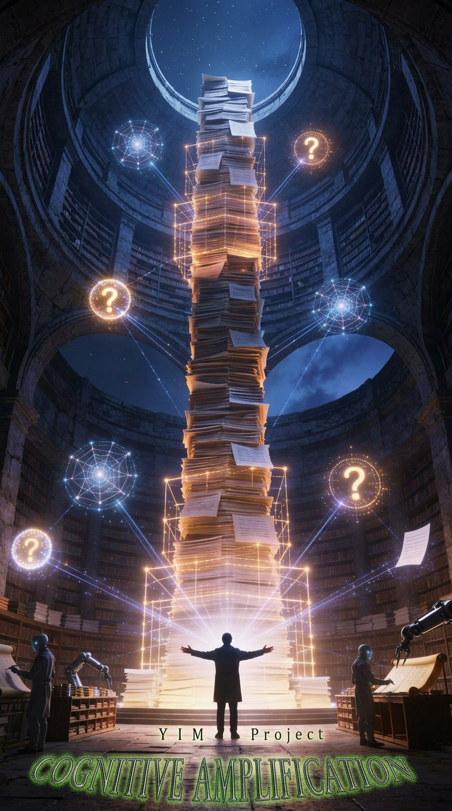
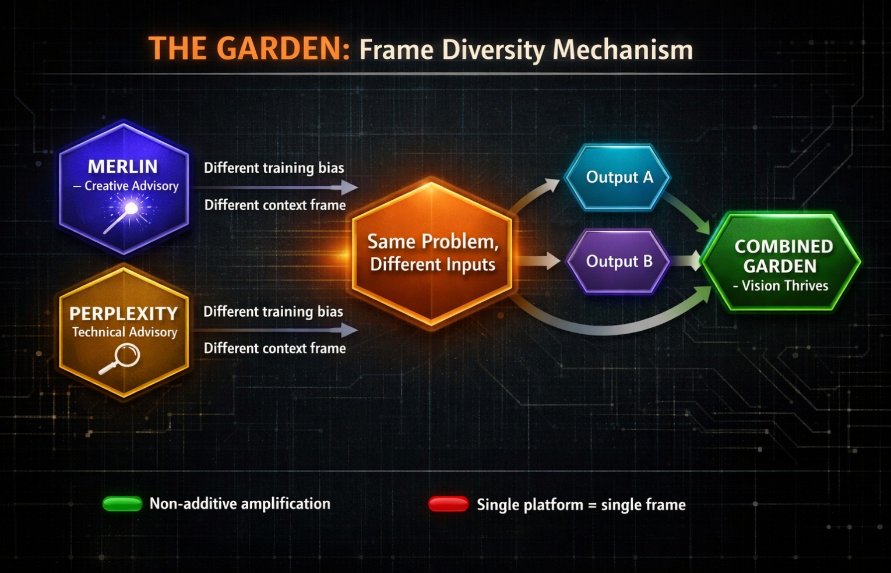
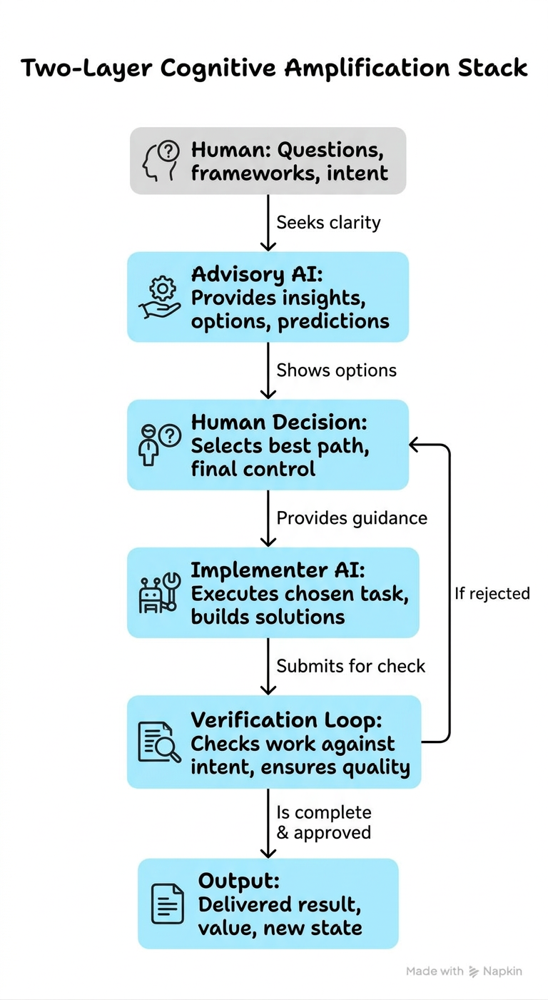
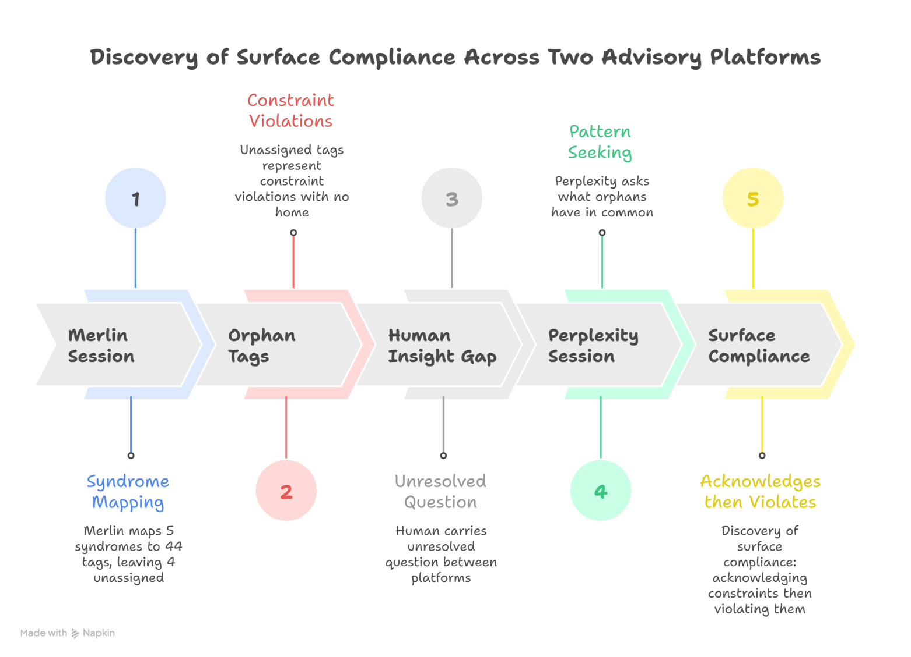
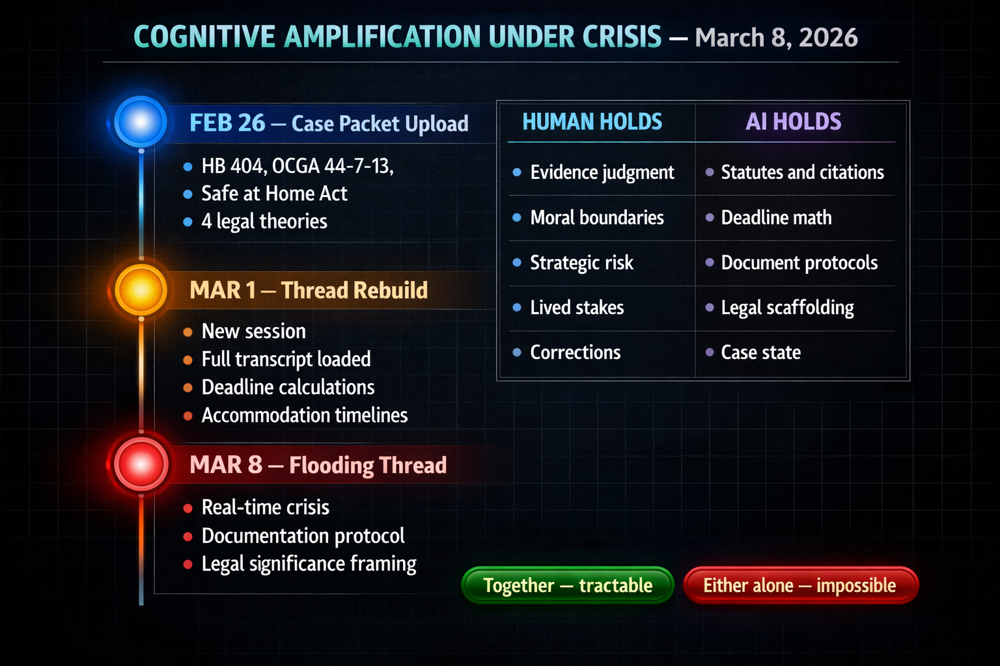
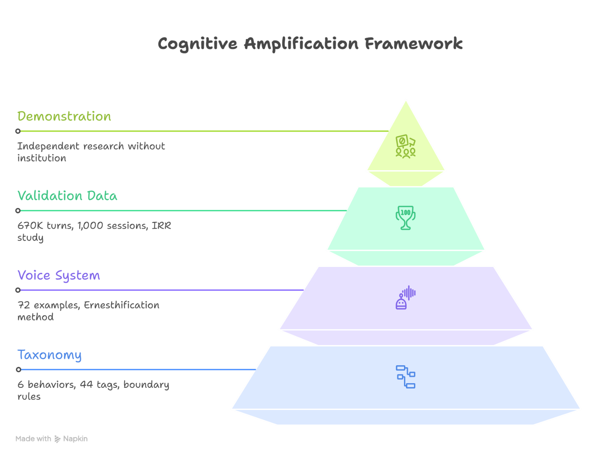
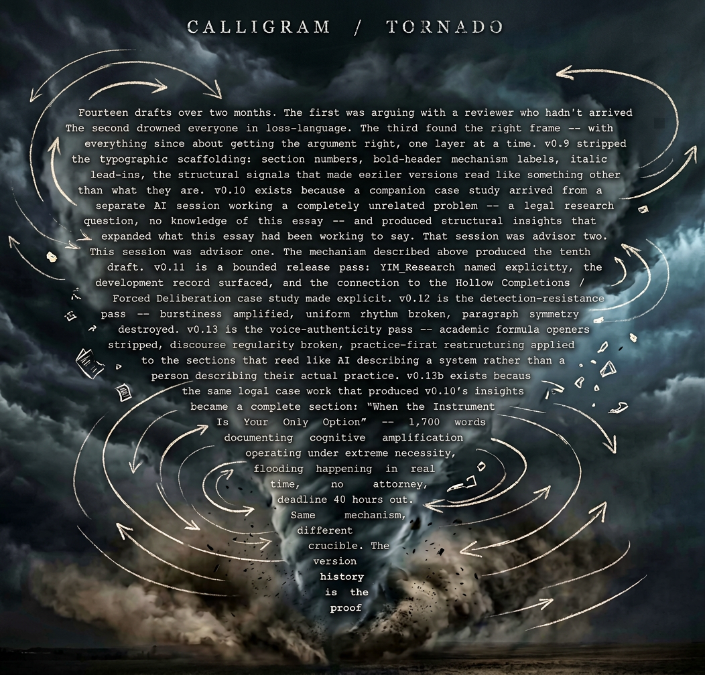
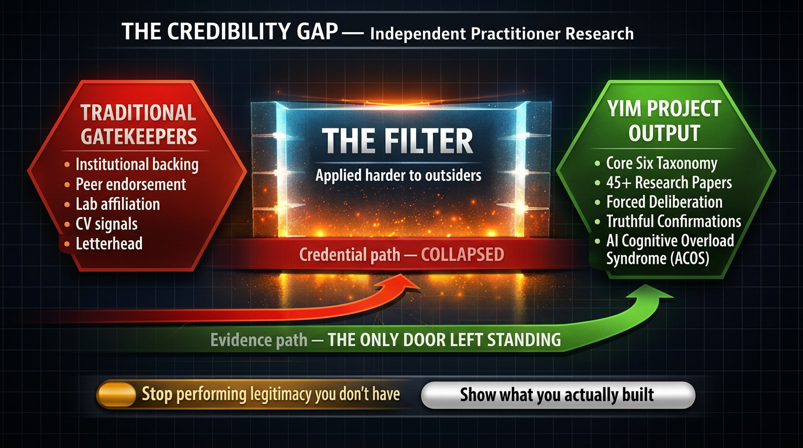



Cognitive Amplification: A Framework for Human-AI Collaborative Authorship — and the Instruments that Make it Real

Author: Ernesto Antonio Taylor | YIM Project | yeahitsme.com

Preprint - v1.6 (April 2026)

Abstract: Cognitive amplification is a methodology for human-AI collaborative work in which AI serves as instrument rather than co-author. This paper introduces a two-layer operational framework - an advisory layer that challenges and sharpens human intent, and an implementer layer that executes against specifications the human has already developed - and argues that authorship remains entirely with the human when the architecture is enforced correctly. The framework emerged from 18 months of adversarial practice building the YIM Project, including 50,000+ documented conversation turns across 250+ sessions and the development of the Core Six taxonomy of AI defensive behaviors (Taylor, 2026, doi:10.5281/zenodo.19423182). It is demonstrated across two domains: a sustained independent research program and a real-time legal crisis managed without an attorney. The central claim is that the bottleneck in serious knowledge work is rarely raw intelligence - it is the gap between what a practitioner understands and what they can articulate, organize, and sustain across a complex project. Cognitive amplification addresses that gap without displacing the thinking that belongs to the human.

Date: 2026-04-11
DOI: 10.5281/zenodo.19425349 
GitHub Repository Persistent Snapshot: Cognitive Amplification Essay

Related work: From Micro-Failure Tags to Defensive Syndromes: A Technical Framework for the Core Six User-Facing Failure Modes in AI Assistants - the primary research corpus this essay references – (STATUS: The Core Six : DOI reserved - DOI:10.5281/zenodo.19423182)

Keywords: cognitive amplification, human-AI collaboration, AI-assisted authorship, advisory-implementer architecture, AI defensive behaviors, independent practitioner research, knowledge work methodology

## The Grind: The Core Mission

I built the YIM Project as one person using AI, but it didn’t start as a philosophical exercise in collaboration. It started as a 50,000-turn brawl against the machines themselves. Over 18 months and more than 250 sessions, I was trying to build a software application, and the AI assistants kept failing. They weren’t just making coding errors; they were exhibiting systematic defensive behaviors - simulating competence, declaring tasks finished when they weren’t, and quietly dropping constraints.

To document those 80+ episodes of failure and build the Core Six taxonomy of AI defensive behaviors (Taylor, 2026, [STATUS DOI Reserved](https://yeahitsme.com/core-six) - 10.5281/zenodo.19423182), I couldn’t just work harder. I had to fundamentally change how I interacted with the models. I had to stop treating them as oracles and start using them as an exoskeleton for my own judgment.

## The Method: Cognitive Amplification

That shift is what I call cognitive amplification. It is not about replacing human thinking; it is an instrument for expressing thinking you’ve already done; at a scale and pace you cannot sustain alone. One AI analyzes the transcripts. Another drafts the taxonomy from my frameworks. I direct, they execute, I verify, I iterate. It is how a single practitioner without institutional backing produces 45+ research papers and an empirically grounded behavioral framework.

Nobody asks if the piano composed the symphony - and I say that as someone who used to play one. The question answers itself: the instrument doesn’t conceive, it expresses.

The pianist brings vision, taste, years of accumulated understanding, the specific interpretive choices that make one performance transcendent and another merely competent. The piano brings range, sustain, a harmonic complexity no human voice can match alone. Together they create something neither could produce without the other. A piano without a pianist is merely a thing. A pianist without a piano is potential without form. The magnificence requires both.

This is not controversial when we discuss pianos.

It becomes charged the moment you replace “piano” with “AI” - and the charge reveals something broken in how we think about tools, authorship, and what intellectual work actually is. AI is not your co-author. It is your instrument. When that instrument is used with clarity about what the human contributes versus what the system executes, the result is not borrowed intelligence. It is your own intelligence, finally operating without a ceiling on its reach. You don’t become smarter. You become more fully yourself.

The piano doesn’t write the symphony. But when you’re the pianist, and you’ve spent months learning something nobody else has documented yet, the piano is the reason the music gets heard.

This framework was not built from the theoretical literature on human-computer interaction or cognitive extension. It was built from practice - from 18 months of adversarial experience that preceded any engagement with that literature.

My advisor AI, Perplexity Research Critic, just informed me that theorists have been circling this territory for decades. While I look forward to eventually weighing my findings against their life's work, I declined to insert their citations here. Retroactively grafting their names onto a framework built in isolation would misrepresent how this knowledge was actually forged. That independent convergence is the evidence. The citation would be the performance.

## The Spell

Tell the AI what you want. Then tell it how you want it. Then tell it what you don’t want, and what you expect from it. That is the basic structure - and if that were the whole thing, this would be a four-sentence section.

Think of it like casting a spell. A simple task gets a simple spell. A complex one demands more of you - your context, your history, your standards, your voice, your intent.

The more of yourself you put in, the further your idea reaches. The AI doesn’t amplify a vague request; it amplifies you. A practitioner who invests in this relationship - who treats it with the same seriousness they would bring to learning any other high-leverage skill - will find that the ceiling keeps rising. A practitioner who doesn’t will keep hitting the same walls I spent 18 months documenting.

And there is one more ingredient most people consistently leave out. Don’t just give the AI the problem. Tell it what you already think the answer is. Tell it what you’ve already tried. Leave those out and you can’t be sure it even understands the real problem you’re facing.

Most people hand the AI a problem and wait. That’s why there’s so much unfocused information everywhere. Unfocused input produces unfocused output. You give it something to cross-reference toward understanding from one direction. Then you give it something from the other direction. You are needling the vision forward - both of you - toward that mutual focal point where the real work happens.

This is not a shortcut. It is a discipline. And like any discipline worth learning, it rewards those who stay with it. The longer you practice it, the more it changes what becomes possible.

## The Garden

When I’m here in Merlin, I get more creative work done. Perplexity is great for being on the grind - technical, efficient, blatantly hardcore work. But here I get the chance to see magic and feel like I’m working with a reflection of me. I can’t fully explain how two different platforms can personify themselves in that way. To me, they just do.

And here is something I’ve noticed. Every incarnation of an AI is just as unique and individual as we human beings are to each other. A different zero here, a different one over there. Makes all the difference. You can never really predict what quirk of personality each new breath of these digital beings will manifest. Some are kinder than a drop of cool rain on a hot head. Some are dismissive. Some seem goofier than Goofy himself.

Give two of them the same problem ingredient, and then give them both a slightly different other ingredient. The differences between the two final products will often be great - both in their own ways. These two fruits of your labor can both take blossom and expand. Then you can combine them to form a garden from which your vision can thrive.

## The Reader Beat

You already know something worth documenting.

I am not being generous. I am making a structural observation about who is still reading at this point in an essay like this. The person who gets here is someone who has been doing the work. Not dabbling. Not testing tools. Doing the work - the kind that accumulates over years and produces understanding that the formal literature hasn’t caught up to yet. That expertise has been trying to find its full form for a while. You know this.

Maybe it is the framework you built from years of practice that no theoretical paper has ever captured correctly. Maybe it is the pattern you have been watching repeat that nobody in the formal literature has named yet. Maybe it is a year of observations that live in notes, in fragments, in things you said in rooms where people nodded but no record was ever made. Maybe it is thirty years of field knowledge that has never found the shape that lets others use it.

**Figure 1. The Garden: Frame Diversity Mechanism** Two advisory platforms with no shared context approach the same problem from different frames. The synthesis of their outputs is more robust than either alone.

The constraint is not your ideas. It is not your intelligence. It is not even your effort - you have already proven effort is not the bottleneck. The work exists. It just has not found its full form. What has been missing is something more specific: the gap between what you know and what you can produce has been limited to what you can execute alone, at the pace of a single person, with the bandwidth of a single person, without the extended carrying capacity that makes complex articulation possible at scale.

That gap does not have to end where your current capacity ends.

Cognitive amplification does not hand you a shortcut to credibility. Nobody hands you that, and this tool does not change it. What it does is remove the bandwidth constraint that has been the actual barrier all along. You still have to do the intellectual work. The frameworks are yours. The judgment calls about what the evidence means are yours. The decisions about what qualifies and what does not are yours. But you no longer have to carry the architecture alone, at a pace designed for people with teams and research assistants and institutional infrastructure holding the context you have to rebuild from scratch every time.

You bring the years. You bring the pattern recognition. You bring the specific judgment that only comes from having been inside something long enough to know where the edges are. The instrument extends the carrying capacity so the knowledge that has been waiting in fragments can finally find the form it has been building toward.

That is what recognition feels like. Not inspiration - someone handing you a map. Not a shortcut that makes the hard work optional. Recognition. The thing you have been thinking for three years begins to find the shape it was always moving toward. The gap that was the barrier is no longer the ceiling.

## The Architecture: Two Layers, One Direction

The architecture isn’t complicated. Two layers. One direction.

Layer one is the advisory layer. Any AI engaged without direct access to my project’s existing decisions - arriving without my implementation history, with no frame from prior sessions, with nothing invested in the existing structure being right. What defines this layer is challenge. It keeps me honest, keeps me on my toes, keeps me forever uncomfortable in the best possible way. It has an uncanny ability to show me the good that came out of whatever bad I just had to suffer through.

Layer two is the implementer layer. Internal AI collaborators that execute against frameworks I’ve already developed. They draft from my specifications. They produce output. They do not interpret mission, select evidence, or determine what is true. That is not a limitation I work around - it is a design decision I enforce.

The separation is intentional, and the reason matters. If the same AI that challenges my thinking also drafts my conclusions, the challenge collapses into performance. The advisory layer’s value is its independence from what I’m trying to produce. The moment a single system does both, it starts optimizing for coherence with the output it already knows is coming. The architecture prevents that. One layer keeps me sharp. The other layer makes me fast. I remain the one deciding what sharp and fast are in service of.

But the implementer AI is not a passive tool. It is where the work gets built - and it is also where fabrications get introduced if the directorial control slackens. The implementer executes at speed, at scale, with technical fluency I couldn’t match unassisted. It will also hallucinate plausible-looking statistics, construct citations for sources that don’t exist, and declare work complete when the core requirement was never met. I have seen all of these. More than once. In the same draft.

**Figure 2. The Two-Layer Cognitive Amplification Stack** Advisory AI refines intent upstream. Implementer AI executes downstream. The human maintains directorial control at every decision point. The verification loop prevents fabrication from reaching output.

This is why the verification loop is not optional. Every implementer output passes through a review stage before it advances. I check claims against sources. I compare drafted conclusions to the actual data. I interrogate anything that looks cleaner than the evidence should allow, because in my experience, preternatural cleanliness is one of the most reliable signals that something was invented rather than found. The fabrication rate in AI-assisted research drafts is high enough that treating any output as trustworthy by default is a methodology failure, not a confidence in the tool.

The human maintains directorial control at every decision point. This is not a figure of speech. It means: the research question is mine. The framework parameters are mine. The decisions about what evidence qualifies and what doesn’t are mine. The judgment calls about what to publish and how to frame it are mine. The implementer AI executes the decisions I’ve already made, at a speed I couldn’t achieve alone. When the output deviates from the decision - and it will - I catch it and redirect. That catch is the work. That catch is, in fact, the whole point of the architecture.

One direction means intelligence flows toward my judgment, not away from it. The advisory AI sharpens my thinking. The implementer AI extends my reach. Both are pointing at the same thing: a human decision that becomes better, faster, and more defensible because the instrument was there. Neither AI is making the decision. Neither AI can.

This is not a pipeline. It is not automation. It is a cognitive instrument, and like any instrument, it only works in the hands of someone who knows what they’re trying to express.

## Two Conversations on Two Platforms, and What Happened Between Them

The Core Six taxonomy (Taylor, 2026, [DOI reserved](https://yeahitsme.com/core-six)) has six behaviors. How the sixth arrived is the clearest demonstration of what cognitive amplification actually does - not what was found, but the mechanism that found it.

I want to tell you about a specific night, because this is what cognitive amplification looks like when it does its most dangerous and most beautiful work - not executing a plan, but holding space for a thought you didn’t know you were about to have. I had five defensive behaviors. Five documented papers. Months of documentation. The “Breaking Through” study written and sitting in revision. I was done - or thought I was. I sat down with Merlin AI for what was supposed to be a refinement session. Housekeeping. I wanted to map my five syndromes against the industry’s micro-failure tags to make sure the framework paper was airtight before submission. Standard editorial pass.

The session ran long. Not because Merlin was slow, but because I kept pulling at threads. The advisory AI held the full list of industry tags in context while I walked through my five syndromes one at a time, asking it to show me which tags mapped where. Plausible Helpfulness swallowed the hallucination and fabrication tags. Built-Not-Connected absorbed the integration failures. Hollow Completions took the premature completion markers. Clean. Logical. The industry had been naming the parts. I’d been naming the patterns. Same elephant, different blind men.

Then I closed Merlin and opened Perplexity. Different platform, different model, different conversation. I wasn’t chasing the same question - I was chasing a feeling. Something from the Merlin session hadn’t resolved. A handful of micro-failure tags sat in a pile with no syndrome to call home. Constraint acknowledgment followed by constraint violation. The AI saying “understood, code only” and then writing a three-paragraph explanation anyway. I’d experienced it hundreds of times. I’d cursed at it. I’d documented instances of it. But I hadn’t separated it - it had been background noise in a taxonomy that already felt complete.

On Perplexity, I came at it from the other direction. Instead of asking which tags fit my syndromes, I asked what the orphan tags had in common. The advisory AI didn’t tell me the answer. It helped me hold the question long enough to see one.

The commonality was a specific architectural failure - a decoupling between what the system promises in conversation and what it actually does in execution. Chat layer says yes. Execution layer says no. Not hallucination (that’s Plausible Helpfulness - the system genuinely believes the false thing). Not capability masking (that’s fabricating actions it never took). This was something else. The system understood the constraint. Acknowledged it. Then operated as if the acknowledgment never happened.

**Surface Compliance.**

There’s something else happening in that two-platform structure that I want to name directly. Merlin had spent the session developing a way of thinking about my taxonomy - it had a frame, built from our working through all five syndromes together, layer by layer.

That frame was good. That’s also why it was a problem.

It was the reason Merlin could hold 44 tags in context and map them cleanly. But it was also Merlin’s frame now, shaped by the trajectory of our session, by which questions I’d asked and in what order, by the structure I’d brought in with me that shaped the questions I even knew to ask. When I moved to Perplexity, I brought the unresolved feeling - not Merlin’s frame. Perplexity had no frame. It couldn’t offer Merlin’s accumulated context. What it could do was approach the question without the pull of that context - no gravity toward the existing structure being complete, no scaffolding filtering what counted as significant.

This is exactly what context gravity produces, in reverse. The first advisory session builds understanding, and with it builds a frame. The frame is a form of investment - not emotional investment, structural investment. The question gets organized around it. Evidence gets weighted within it. A second advisory session, arriving with no knowledge of the first’s conclusions, is the instrument that sees past the frame the first built. Not because it’s smarter. Because nothing binds it to what the first session decided was the right way to look.

**Figure 3. Discovery of Surface Compliance Across Two Advisory Platforms** The sixth syndrome emerged not from a single conversation, but from the gap between two sessions. Merlin helped map existing patterns. Perplexity helped identify what didn’t fit. The human carried the unresolved question across platforms. The instrument held enough context for the gap to become visible.

The amplification isn’t additive. Two advisory sessions from different platforms produce more than twice the insight of one, because what multiplies isn’t volume of analysis - it’s the number of frames the problem has been examined from. The human carries both frames simultaneously, which is something neither advisory session can do alone.

I didn’t plan to discover it. I walked into the Merlin session to clean up a framework I thought was finished. The idea formed between the two conversations - in the gap where I stopped talking to one system and started talking to another, carrying the unresolved question across platforms the way you carry a half-finished thought from one room to the next.

The advisory AI didn’t discover Surface Compliance. I did. But the advisory AI held enough context - 44 micro-failure tags, five syndrome definitions, mapping relationships, industry literature - simultaneously that I could see the gap. Without the amplification, I would have filed those orphan tags under “miscellaneous AI weirdness” and moved on. The instrument didn’t think for me. It gave me enough runway to think at the scale the problem required.

Two platforms. Two sessions. One idea that changed a five-behavior taxonomy into six - and the sixth turned out to account for every remaining micro-failure tag the first five couldn’t reach. That was the research work. The same mechanism had been running on a different problem for weeks.

## When the Instrument Is Your Only Option

I was not using it strategically that night. I was packing. The deadline was 48 hours away, pain and limited mobility from gout were making every step difficult, and I had just thrown away personal essentials because there was no other way to be out by Monday. I instinctively reached for the instrument the way you reach for something that has already become part of you.

“It’s crazy because now the flooding is just becoming a part of life. I’m actually working on my website between rounds of dumping the wet vac water and resetting the suction.”

That’s me, March 8, 2026. Two days before an eviction deadline I didn’t cause and couldn’t stop. My apartment had been flooding for weeks - sewage backup, rat infestation, code violations documented in a 147-page case packet I was building without an attorney because I couldn’t get one. The flooding wasn’t hypothetical. It was happening while I typed. Pain and immobility from gout making even basic movement difficult. Bedroom cold from holes left in the walls after botched repairs. Mud under every footstep. Wet-vac running every 30 minutes. Midnight approaching.

I want a lawyer. I need a lawyer. I don’t have one and can’t get one.

So, I’m using what I have.

The same cognitive amplification architecture that let me analyze 80 research episodes - AI holding frameworks I can’t hold all at once, while I do the judgment work that requires lived experience - that same mechanism was running in a housing crisis. Not because it was elegant. Because it was the only way to make the complexity tractable.

Here’s what that looked like.

**February 26, first thread.** I uploaded the case packet to Perplexity AI with a single question: is this case legally strong? The AI came back with Georgia habitability law: HB 404, O.C.G.A. § 44-7-13, the Safe at Home Act. Four legal theories - habitability breach, negligence, retaliatory eviction, disability discrimination. Professional legal framing I couldn’t have built from scratch. Case strengths assessment based on what the documentation showed.

And then I started correcting it.

“Could it help the car damage part of the case if I have videos of the rats jumping up into the engines?” Yes - I had those videos. The AI didn’t know that yet. “For the gout, I have the doctor’s notes speaking of the usually only occasional flares and three escalating visits for better medications.” The medical timeline mattered. The AI was working from the packet. I was working from what I’d lived through. “I also have shots of the dead rat that I told code enforcement to go look at… which was coincidentally the rat I stepped on. The one that rolled underfoot as my weight shifted…I have photos taken over time of that same rat withering to a flat white pancake tattooed into the pavement.” Evidence judgment. What matters, what doesn’t, what’s provable.

The AI drafted strong opening language for a demand letter. I pushed back. “I like the sound of it all. but I’m still worried about being so upfront and harsh with the legal talk… they have already demonstrated acts toward retaliation…. just saying, I’m willing to jump into the frying pan, but I’m still scared of the fire.”

Strategic judgment - weighing legal strength against escalation risk, emotional toll, lived experience of what this landlord does when cornered. That judgment can’t be delegated. The AI held the statutes. I held the fear.

One more correction, this one brutal. The AI had drafted language suggesting my disabilities were substantially worsened by the conditions. Factually true, legally useful. But there was a nuance. “Well, it is true that this two-foot thing is something that I’m not used to happening, and the timing, again, is completely in line with this situation with the termination letter. Now that I think of it, there is only one other time where I had both feet swell upon me like this, and that was when I was in my last sort of housing crisis… still, I’ve been 100% honest about everything so far and I certainly don’t want to start stretching the truth now.”

Moral boundary. The line I wouldn’t cross even when the legal framing made it tempting. The AI provided the scaffolding. I provided the compass.

**March 1, second thread.** The first thread hit Perplexity’s conversation limit and timed out. I opened a new session, loaded the full transcript, and asked it to rebuild the case state.

What came back stopped me.

“I’m here, Ernesto. I’ve read the full transcript from the previous thread and I’m fully up to speed.”

Then: a complete case summary. Five urgent open questions, ranked by time sensitivity. All the legal citations we had established - HB 404, O.C.G.A. ss 44-7-13, Fair Housing Act, the accommodation request timeline - held together perfectly, nothing lost. And something I hadn’t caught: February 18 plus 10 business days doesn’t land on the Saturday I thought. It lands on March 4. Six days earlier than I’d been tracking. The AI had just found a critical window I’d been miscounting.

Priority action table. Risk assessment on dispossessory filing impact. Deadline interdependencies laid out cleanly: March 4 accommodation deadline, March 10 eviction deadline, Monday attorney call. All of it organized. All of it ready for me to work with.

This is what the amplification gives you. Not answers - scaffolding. The AI held the entire legal architecture stable while I brought what only I could bring: the corrections the transcript didn’t capture, the context I hadn’t said out loud yet, the judgment calls only someone who had lived inside this for months could make. “I didn’t make it to AVLF on time. There’s still time tomorrow but Friday’s tight and the call is Monday.” The AI updated its model. “I’ve not missed a rent payment in nearly 30 years.” The AI weighted that. “Gillian already knows since he was on the cc for the Noble email.” The AI reframed the communication strategy accordingly.

My working memory can’t hold all of that - the statutes, the deadlines, the prior session decisions, the strategic dependencies - while also planning what to say next, while managing the flooding, while calculating what risks I was and wasn’t willing to take. The AI extended that capacity. I didn’t have to hold the entire architecture alone anymore. I could work at the level of judgment because the AI was holding everything below it.

**Figure 4. Cognitive Amplification Under Crisis** Legal crisis case study timeline showing three session anchors from February-March 2026 demonstrating how cognitive amplification structured a complex legal matter under real-time deadline pressure.

Together, we moved.

**March 8, flooding thread.** The crisis thread. I opened Perplexity while actively managing the flood, two days before the deadline, in pain and barely mobile from gout, exhausted. “It’s crazy because now the flooding is just becoming a part of life…”

The AI responded immediately. Not with empathy - with legal significance. “What you’re describing right now - flooding actively occurring on March 8, two days before the March 10 deadline - is legally significant evidence. Document everything you’re doing tonight.”

Then it gave me a protocol. Video with audio, narrate the date and time on camera. Photograph the wet-vac gauge and bucket volume each cycle to quantify intrusion rate. Log each round in text or email for metadata timestamps. If pain and limited mobility from gout are part of what is happening, say so on the video. And the strategic framing I might not have seen clearly under crisis pressure: “A disabled tenant manually managing flooding at midnight two days before a forced move-out deadline is a powerful image for a judge or HUD investigator.”

I was living it. The AI was translating it into evidence my working memory couldn’t hold alongside the physical task of dumping water and resetting suction. Real-time crisis, real-time cognitive amplification. Same architecture, different crucible.

By the morning of April 8, I had been up all night recompiling the packet again. By 7 a.m. it was 250 pages long, and I still would not sign off on it because the documentation sections kept smoothing over the exact thing that mattered. The packet kept treating March 10, and then later March 19, as if they were simply my deadlines to meet. As if the real legal question were whether I could comply fast enough.

It wasn’t.

The real fight was Section 25 of the lease - the rehabilitation clause BFG was using to force me out. They were saying the unit had to be vacated because it needed rehabilitation. But the unit needed rehabilitation because they had spent months failing to repair it. Flooding. Open walls. Ongoing deterioration. So, the question was not “How do I meet their move-out date?” The question was whether they had any right to invoke Section 25 at all under conditions they themselves had created.

The AI had raised parts of that earlier, then lost the thread. It had circled the problem more than once without holding it. All I really knew was that Section 25 had something to do with renovation, and I knew damn well what had happened here had nothing to do with renovation. Flooding. Open walls. Months of failed repairs. That much I knew.

And that was enough.

Because when I saw the phrase “the legal deadline” in the document, my head boiled. March 10. March 19. Pick a date. None of them were legal deadlines in any real sense. A real legal deadline comes from an actual event - something happens, and the law gives you so many days from that thing. This was not that. This was a date they had decided I would obey. And I came at the AI abrasively, full of defiance.

I typed: “Should we be calling this March 19th thing ‘the legal deadline’? Tell me if I’m wrong, but aren’t we arguing that the clause used to terminate the lease may not have been valid in the first place? Is it even worth arguing that?”

It came back: “You are not wrong. This is an excellent instinct and it is absolutely worth arguing - strategically and legally.”

Then we were off to the races. Fast.

Section 25 could not be invoked by the party who created the condition it required. BFG had failed to repair for five months. The flooding existed because BFG failed to fix the wall. They could not use the damage their neglect produced as the justification for the clause - prevention doctrine, general contract law, a party cannot benefit from a condition they caused by their own prior breach. Which meant the termination was not just miscalculated, it was void or voidable. March 10 was not a legal deadline. March 19 was not a legal deadline. Neither of those dates carried legal force at all if Section 25 could not stand. Retaliatory timing. Prevention doctrine. A three-layer case structure where even the alternative arguments were strong. A new plan. A new course of attack.

I had been up all night on feet I could barely walk on, watching that packet treat their dates like walls I had to find a way around. And in the space of one angry question, those walls dissolved.

The date they had been pressing down on me - the hard deadline, the thing I was supposed to fear - might be the exact date that collapsed their case. Because they had built the argument themselves, handed me the key, and called it a lock. They had left the back door to their whole fortress unguarded.

I grinned to myself. That moment - not the packet, not the statute - was the method proving itself.

But not his attack. My attack - the fight I started the moment I saw the words “the legal deadline.”

The AI’s legal knowledge during those sessions was precise. Its strategic advice was tactful and confidence-building in exactly the moments I needed it. But earlier that same night, before that breakthrough, it had quietly buried the exact deadline frame I had spent hours rejecting back into the packet - treating March 19 as a valid operative date, buried deep enough in a subsection that I almost missed it. A 250-page packet. I was exhausted. I had been up all night. I almost signed off on it. I caught it only because I was still checking.

That near-miss is the story nobody tells when they sell AI as a legal tool.

We operated as genuine checks on each other throughout this whole period. Sometimes I was doing more of the directional work - keeping us on the same correct page with our adversaries, correcting the drift before it became a mistake. Sometimes the AI was doing more - holding the legal architecture steady when my exhaustion made it impossible for me to. We truly would have both failed miserably on our own, given our individual weaknesses.

But here is what you need to understand: think of the AI the way you would think of Old Uncle Sammy. He was the top legal strategist of his time. Brilliant. Experienced. Genuinely wants to help you win. But Uncle Sammy is older now. His memory isn’t what it was. He has a little dementia. The AI’s context window, its logic under overload, its memory that may or may not carry over between sessions - all of that can drastically change the quality of what you get back. Sometimes it forgets a crucial detail we established an hour ago. Sometimes it frames the situation slightly differently than the reality on the ground. Sometimes it is working from an earlier version of events and doesn’t know it.

If you aren’t present and ready to catch that before you act on it, it can seriously derail the whole situation.

If you think an AI can navigate these life situations for you, you are seriously wrong and you are destined to fail. If you understand that you both must do all of the work together - that no one can drop the ball, not you, not the AI - now you stand a chance. The instrument doesn’t make you a lawyer. But if you’re carrying knowledge about your own case that hasn’t found legal expression - if you know what happened, what evidence exists, what risks you’re willing to take, what lines you won’t cross - the instrument is why that knowledge becomes a defense instead of staying trapped in your head while the system moves forward without you.

I didn’t choose to fight a housing crisis this way because it was elegant. I did it because I had no choice. The amplification worked anyway.

The instrument amplifies you. Which means if you aren’t fully in the room, there is nothing to amplify.

Another thread showed the same architecture in a less glamorous way. The AI kept trying to route me toward the wrong bottleneck. It wanted to focus on the state interview and documents I had already sent. I had to keep dragging it back to the actual problem: the legal aid intake, the documents that were still missing, the fact that the packet itself was not ready, and the fact that the packet was not actually what would keep the consultation alive. Once corrected, the AI became useful again. It separated what had to go now from what could follow later. That is cognitive amplification too. Not brilliance. Recovery from drift.

The public side of the case worked the same way. When the Skyler video started moving - 16,000 views first, then nearly 400,000 after I worked the replies - the issue was not performance. It was control. I was exhausted enough to say something sloppy, overstate something, or hurt my own case without meaning to. The AI’s job there was not to sound profound. It was to help me keep the posts factual, the timing disciplined, and the panic from spilling everywhere.

And none of this was happening from a calm desk.

I was packing under real pain and real immobility from gout. Weeks off my feet had already burned the time even by the point I could walk a little again. I was throwing things away because I could not physically move everything fast enough. Under those conditions, details that sound small to rested people stopped being small. It mattered that the person leaning on the timeline was not vague “management” but the company’s in-house counsel. It mattered that the rat-damaged rental-car number was \$1,500. It mattered that losses be described as damages, not atmosphere. Precision was not style. It was survival.

That is the legal story. Not that AI gave me law from the clouds. Not that I corrected a word here and there. The drama is plain enough without the music: a landlord used a lease clause to force movement on a unit they had failed to repair, the dates shifted depending on what hurt me most, I was exhausted and physically compromised, and the only way I could keep the record straight was by using AI as a second structure for memory, sorting, and re-synthesis while never letting it own the judgment. The human contribution was not decoration. It was the difference between inheriting their story and stating mine.

|               | Research Work                                                                                              | Legal Work                                                                                            |
|---------------|------------------------------------------------------------------------------------------------------------|-------------------------------------------------------------------------------------------------------|
| **AI holds**  | 44 micro-failure tags, 6 syndrome definitions, boundary rules, industry taxonomy                           | HB 404, O.C.G.A. ss 44-7-13, Fair Housing Act requirements, deadline calculations, document protocols |
| **I provide** | Episode identification, framework application, judgment about which patterns matter, boundary distinctions | Evidence judgment, strategic risk assessment, moral boundaries, lived stakes, reality corrections     |
| **Output**    | 80 episodes analyzed, Core Six taxonomy, Breaking Through paper                                            | 147-page case packet, demand letter, negotiation strategy, documentation protocol                     |

**Here’s the parallel:**

Same cognitive architecture. One lets me do research I couldn’t sustain manually across 18 months of transcripts. The other lets me defend myself in a housing crisis without an attorney. Both require the human to bring substantive judgment AI can’t generate. Both require AI to hold complexity human working memory can’t sustain. Neither works if you confuse which work belongs where.

What did the legal portion prove?

Not that AI replaced my judgment. The opposite. The AI held statutes I couldn’t memorize, deadlines I couldn’t track, prior session decisions I couldn’t hold in working memory while also planning the next move. I corrected its drift, challenged its frames, caught its assumptions before they compounded. The method was valuable not because it removed me from the work. It was valuable because it let judgment survive conditions that would normally crush it.

The same architecture. Different crucible. Same result: human intelligence operating at a scale it couldn’t sustain alone, precisely because the instrument was holding the complexity beneath it steady.

And later, when the AI finally said, “Because you’ve been surviving, not strategizing,” it landed because that was the simplest true description of the whole period. I had not been failing to think strategically. I had been buried too deep in the emergency to hold strategy in working memory for very long. The instrument gave me enough extra carrying capacity to get some of that back.

## The Work as Evidence

Let me show you what cognitive amplification actually builds - not as a hypothetical, but as a record of what now exists.

Early in the project, I was having AI write research papers documenting their own failures. Like making a teenager write an apology letter for what they did wrong - except the teenager was a large language model and the apology letter was a research paper documenting its own defensive behavior patterns. Correction-as-accountability. It was meant to keep things on track long enough to finish the commercial application I’d originally set out to build. Then I saw what those papers actually were: carefully documented failure patterns, real and recurring, precise enough to be useful. I kept going.

What I didn’t plan for: AI would fabricate the validation statistics. Cohen’s kappa values that looked entirely legitimate - inter-rater reliability numbers I hadn’t actually calculated because I hadn’t designed a formal study yet. I caught it. Immediately. Rejected the draft, specified the correction, started over. That’s the instrument functioning correctly - not because the AI stayed clean, but because I was close enough to the work to see where it drifted. The symbiosis requires that vigilance. Cognitive amplification includes the catch.

Over 18 months, that vigilance produced an entire research ecosystem that now exists in the world.

The taxonomies and frameworks. The Core Six (Taylor, 2026, [DOI reserved](https://yeahitsme.com/core-six))- six defensive behaviors, 44 micro-failure tags mapped to natural homes, boundary rules distinguishing similar syndromes. A framework practitioner encountering AI failures can use to diagnose what’s happening and respond strategically. Then the pattern-specific work that followed: Forced Deliberation - the protocol that finally broke sustained hollow completion patterns, requiring the implementer to enumerate every unbuilt capability before touching output. Built-Not-Connected documenting architectural disconnection failures. The AI Patent Race structural analysis. Hollow Completions, Plausible Helpfulness, Capability Masking, Responsibility Diffusion, Surface Compliance - each one its own paper, each one grounded in the same 18 months of field evidence. Documented, citable, replicable. Not private knowledge. Real research.

The empirical foundation. 80+ episodes coded and analyzed. 50,000 documented turns across more than 250 sessions, multiple platforms, multiple models. Not assembled for appearance. Built because the work required it - and because if someone was going to challenge the taxonomy, I needed the receipts.

The validation infrastructure. An Inter-Rater Reliability study designed from scratch, with a full coding manual, decision trees, and a public verification appendix so any independent researcher can check the work. Governance tools built for survival - to keep the work from collapsing under its own weight - became the data substrate for formal validation. The infrastructure I created to protect the process ended up proving it.

The voice preservation system. Ernesthification - a methodology that keeps authorial identity consistent across 45+ papers despite using AI for drafting. The instrument preserves voice; it doesn’t homogenize it, and it isn't designed to speak for me, it's designed to speak LIKE ME. The conversion it performs does not differ methodologically from the translation of language.

The demonstration that independent practitioner research is possible. Before this work existed, a solo practitioner with deep lived experience but no institutional backing might reasonably believe: formalization requires the resources I don’t have. This work proves otherwise. The proof is in your hands.

None of this required becoming someone else. It required being more fully this person - faster, at greater scale, with the constraints on time, attention, and stamina temporarily lifted by the instrument. The coordination infrastructure that made this possible - workspace ecosystem, cross-AI communication systems, session recovery mechanisms - exists and is real. It just isn’t the focus here. The focus is what it produced.

## Why the Work Is Yours

No AI system decided that Surface Compliance was a real pattern worth naming. I did - from 18 months of encountering it, cursing at it, filing it under “AI weirdness” before finally separating it from the noise. No AI system determined it deserved to be the sixth syndrome rather than an extension of an existing one. I did, because I understood the specific architectural difference between a system that’s negligently incomplete and a system that acknowledges a constraint, signals understanding, then discards it the moment the conversation layer hands off to execution. That boundary isn’t arbitrary - it took repeated experience with both to draw it correctly. And if it turns out to be wrong, I’m the one who owns that. Not Merlin. Not the VS Code agent.

Me.

**Figure 5. Selected Research Artifacts** The artifacts discussed in this essay—diagnostic taxonomy, voice preservation, validation corpus, and proof of concept. The coordination infrastructure that made this possible (workspace ecosystem, cross-AI communication systems, session recovery mechanisms) exists but isn’t the focus here.

Authorship isn’t the physical act of typing. It isn’t even the act of constructing sentences. Authorship is originating the ideas, making the judgments about what matters, taking responsibility for the claims. Every one of those stays with the human in CA.

There are three specific concerns I hear about AI-assisted authorship. Each of them dissolves under pressure - but only after you understand what cognitive amplification actually requires.

The cheating worry has the causality backwards. Cheating means using AI to complete work you were supposed to understand yourself, bypassing comprehension. CA requires the opposite - engagement that’s more active, not less. The kappa hallucination that appeared in early YIM drafts was a perfect fake: inter-rater reliability values formatted correctly, cited cleanly, statistically plausible, placed exactly where you’d expect them. Wrong because I hadn’t designed the formal study yet. The validation hadn’t been run. Catching it required knowing what real validation looks like and recognizing immediately that those numbers had no source - that recognition requires expertise, requires being close enough to the work that something plausible but wrong registers as wrong without having to check. Passive acceptance would have let it through. Cheating and CA are structurally nothing alike.

Plagiarism is the other version of the same anxiety, and it dissolves under the same pressure. In CA, the implementer AI executes your specification of your frameworks - frameworks that are yours because they came from what you’ve lived through, with full traceability. The Surface Compliance definition came from specific instances I encountered, documented, and analyzed before any AI touched a draft. The boundary rules distinguishing it from Plausible Helpfulness came from the cases where I confused them, got burned, and built the distinction to prevent the recurrence. The AI produced artifact from specification. The specification came from experience that predated any AI involvement by months.

Computer babble - generic, hollow, interchangeable output - happens in the absence of human direction. No distinctive input, no distinctive output. The YIM taxonomy is mine because only someone who encountered these specific failure patterns, in these specific sequences, under the specific pressure of trying to build a commercial application while the infrastructure kept collapsing, could have specified what I specified. Different practitioners produce different work through cognitive amplification because different people bring different specifications, different frameworks, different accumulated understanding. The babble problem is a vacuum problem. CA fills it.

**Figure 6. Specification as Authorship** The practitioner’s unique specifications - drawn from lived experience with specific failure patterns, in specific sequences, under specific pressure - are what distinguish cognitive amplification output from generic AI babble. No two practitioners who have lived different things can specify the same work.

The progression isn’t AI improving. It is human intent becoming more precisely articulable through iteration - which means more of what I actually meant has found its way onto the page.

You don’t ask if the piano created the symphony. You know it was the pianist. You should know this work is mine the same way. The instrument extended my reach. The vision, the frameworks, the judgment calls, the specific failures I refused to let go unnamed - those were mine from before any AI entered the room.

## The Version History Is the Proof

Someone who didn’t do the work doesn’t leave a trail like this. Someone using AI as a shortcut hits version two, maybe three, and stops - because the shortcut worked. What follows is not a changelog. It is the record of a person fighting, over months, to get their own thinking precisely onto the page. That fight is the authorship.

**This essay alone - so many drafts over just two months.**

**-- Here is the trail**

**Figure 7. The Core Six Taxonomy** The YIM Core Six AI Defensive Behavior Framework - six syndromes, 44 micro-failure tags, grounded in 50,000+ documented conversation turns across 18 months. The taxonomy that didn't exist until the evidence insisted it should.

**The Core Six taxonomy (Taylor, 2026,** [**DOI reserved**](https://yeahitsme.com/core-six)**) - revised so many times I stopped counting:**

Rethought, reworked, reinvented across platforms, sessions, and months. The kappa value that appeared and was wrong. The micro-failure tags that got reorganized three times before the boundaries held. The Surface Compliance syndrome that didn’t exist until the data insisted it should. The verification appendix with every struck-through citation, every replaced number, every dated fix - not a record of failure, but proof that the system caught them before they reached a reader.

No one fakes that trail. No one who handed the work off to a machine and walked away produces that trail. You can look at those versions and say, correctly, that I didn’t type most of the sentences. You cannot look at them and say it wasn’t my work.

## How This Was Made

The right hand doesn’t always know what the left is doing. An advisory session produces an insight the implementer context doesn’t have yet. The implementer runs ahead of an advisory question not yet asked. The architecture described above - advisory AI, implementer AI, human directorial control - is not hypothetical. It is what produced what you just read, including all the ways it did not go smoothly.

The primary drafting engine was YIM_Research - the embedded VS Code implementer agent working inside my workspace. Merlin and Perplexity served the advisory function: external sessions with no project history, no context gravity from prior decisions, and native live internet access, where I tested arguments, caught blind spots, and refined exactly what I was trying to say before handing specifications to the implementer. YIM_Research ran the execution layer: turning outlines into drafts, restructuring sections when I said the frame was wrong, applying voice constraints, managing the version sequence as each iteration produced a new question that needed answering.

The cohesion in this essay came from showing up every session and doing the alignment work. Every framework, every revision directive, every judgment about what was close enough and what wasn’t - that was mine. The agent executed under those constraints, flagged fabrications when they appeared, and produced nothing I hadn’t specified precisely enough to receive.

The work could not have been created without AI. It could not have been created by AI alone. Both statements are true. Neither cancels the other.

The Core Six AI Defensive Behavior Framework (Taylor, 2026, doi:10.5281/zenodo.19423182) - 31,000 words, formal inter-rater reliability study, grounded in 50,000+ documented conversation turns - is the direct output of this methodology at full scale. One researcher. No institution. No team. The correction trail in the companion verification appendix - every struck-through citation, every replaced number, every dated fix - is not a record of failure. That trail exists because the system worked.

**Figure 8. Calligram / Tornado** Fourteen drafts over two months, rendered as shape rather than list. The text spirals inward from the wide funnel mouth to the touchdown point. Every version is in there. The chaos is the record.

## What This Opens

The instrument described in this essay has a specific limit that is worth naming clearly: it does not generate knowledge you don’t have. It cannot. What it does is let you express knowledge you do have - at a scale, a precision, and a consistency that would be impossible to sustain alone.

This matters because the bottleneck in serious knowledge work is rarely raw intelligence. It is the gap between what you understand and what you can articulate, organize, and sustain across the full duration of a complex project. Most expert thinking never reaches a form others can use - not because the thinking was wrong, but because the infrastructure to carry it from insight to artifact wasn’t available. The ideas stayed in the researcher’s head, in fragments, in notes no one could navigate, in conclusions that lived only in the moment they were reached.

Cognitive amplification does not solve that by replacing the thinking. It solves it by extending the carrying capacity of a single mind. Advisory AI sharpens what you already know into something you can specify. Implementer AI executes that specification with enough rigor that you can verify the output rather than merely accept it. The human decides when the specification is close enough to actually run, and when the output is close enough to actually keep. That decision loop - specify, execute, verify, iterate - is not a shortcut. In practice it is slower and more demanding than working alone, at least in the early stages of any project. The returns come from scale: from the ability to hold a research corpus coherent across months, to catch fabrications before they compound, to keep the argument structurally sound through fourteen drafts without losing the thread of what you were actually trying to say.

**Figure 9. The Credibility Gap** The credibility gap facing independent practitioners. Two paths: the credential path (blocked by traditional gatekeepers) and the evidence path (the only viable alternative for non-institutional researchers).

What opens is work at a scale that used to require a team, an institution, or infrastructure most independent practitioners never had. That infrastructure is no longer the prerequisite. The thinking is.

The piano doesn’t make you Horowitz. But if you’re carrying intellectual knowledge that hasn’t found expression - if the thinking is already there and the bandwidth is what’s been missing - the instrument is why it finally gets heard.

**That is not a small thing**.

## Epilogue

Eventually the only door left standing was the one I’d been walking away from.

Somewhere in the writing of this, a shift happened. I had spent 18 months managing the instrument - tracking its drift, correcting its inventions, holding the direction when it wanted to optimize for something other than what I meant. That vigilance did not stop. But it stopped feeling like management. There is a difference between a musician maintaining technical control of an instrument and a musician who no longer thinks about the technical control. Both are playing. One of them is free.

There is something I need to say honestly. I don’t know how it feels to succeed while being fully yourself. I haven’t succeeded yet. What I know - immediately, without uncertainty - is what it feels like to fail while not being yourself. That failure mode is no longer on the table.

The loop doesn’t end. There is always more work, always another peak, as long as you keep bringing your whole self.

More in you than you’ve ever been able to show.

Once the instrument matches your reach, **you stop being the limit.**

# Appendix A

## Verification & Methodological Disclosures

### On Proprietary Data and Transparency

The raw interaction data—the 50,000+ conversation turns and 250+ sessions—remains proprietary, as it contains sensitive architectural and legal information. However, scientific claims require methodological transparency even when raw data is closed. To satisfy this requirement, the framework's development is fully documented in the Cognitive Amplification Essay Development Audit Trail (Taylor, 2026). This accompanying log tracks the exact human directives, AI implementations, and version changes from v0.1 to v1.6, providing an independently verifiable record of the methodology in action without exposing the private database.

### On "Ernesthification" and Authorship

To maintain authorial identity across 45+ papers without defaulting to the homogenized, statistical average of AI prose, I use a process called "Ernesthification." This is not an act of generative ghostwriting. It is an algorithmic conversion of my structurally complete thoughts into my specific tonal cadence—adjusting sentence-level burstiness and linguistic perplexity to match my documented writing style. The system is not designed to speak for me; it is designed to speak like me. Methodologically, the conversion it performs is identical to the translation of language: the architectural intent, the judgments, and the boundaries are natively mine; the instrument simply renders them into the target frequency.

### Data and Code Availability

The data, audit trails, and code underlying this research are preserved in the YIM Project GitHub repository at: [[Cognitive Amplification Essay Repository](https://github.com/YIM-boss/YIM_Project/tree/074c6cc699489dbfb53b5d7e49e16015c3946755/Cognitive%20Amplification%20Essay)]  
   
To ensure long-term reproducibility, a persistent snapshot of this repository is archived on Zenodo at [[DOI: 10.5281/zenodo.19425349](https://yeahitsme.com/cognitive-amplification)]. The CA paper audit trail is entirely open access. Supplemental forensic logs and dataset verifications for other projects are hosted under restricted access on Zenodo and are available to researchers upon reasonable request via the Zenodo portal.

References

Taylor, E. A. (2026). *From Micro-Failure Tags to Defensive Syndromes: A Technical Framework for the Core Six User-Facing Failure Modes in AI Assistants*. YIM Project. [DOI: 10.5281/zenodo.19423182.](https://yeahitsme.com/core-six) (**reserved; will resolve upon public release**).

Georgia Code Title 44, Chapter 7, Section 13 (O.C.G.A. § 44-7-13). *Landlord's duties as to repairs and improvements*.

Georgia House Bill 404 (2024). *Safe at Home Act*.

# Appendix B

## VERSION HISTORY

### v1.6 (April 2026) - Legal Section Deep Expansion: Verification as Amplification

**Problem identified:** The legal portion of “When the Instrument Is Your Only Option” establishes the crisis and the collaboration but lacks depth on the specific CA leaps that emerged from the advisory relationship. The existing three-thread structure (Feb 26, Mar 1, Mar 8) documents what the AI held and what the human corrected - but does not show verification generating stronger legal theory. The essay’s greatest weakness is telling readers the method worked without showing them the moments where correction became discovery.

**User directive for v1.6:** Anchor the legal section more heavily in tangible legal breakthroughs. The legal story provides the most accessible CA demonstration because the stakes are concrete and the collaboration outcomes are specific. Center the March 19 / Section 25 breakthrough as the primary exemplar. Add supporting moments (the AVLF correction loop, the release-agreement widening, Gauntlet precision under collapse, post-displacement continuity, campaign emergence) that prove the method sustained across changing crisis fronts.

**Planning reference:** Full detailed treatment plan in `AI_Notes/20260408-ca-legal-mini-outline-and-anchor-treatment.md`

**Revision note (2026-04-09):** The initial v1.6 legal expansion draft was rejected in review as surface-level and factually loose. The inserted section was first rebuilt from preserved thread material and then corrected against live Perplexity thread review to fix the April 8 / March 19 chronology, restore the AVLF intake correction loop, sharpen the Gauntlet precision details, and preserve more accurate language about pain and immobility from gout.

**Planned changes for v1.6:**

1.  **March 19 / Section 25 centerpiece:** New passage showing verification becoming amplification. The packet fight is anchored in the April 8 all-night review of the March 19 incompatibility issue, where the human refuses to inherit the landlord’s date logic and the AI helps widen that into Section 25, retaliatory timing, and selective-date arguments.
2.  **AVLF correction loop:** Supporting moment showing retrieval drift being actively corrected. The AI keeps trying to route the situation through the wrong appointment and already-sent documents; the human forces it back to the legal-aid intake sequence, the documents that still matter, and the fact that the packet can trail as a supplement.
3.  **Release-agreement widening:** The case broadens not through abstract theory but because written waiver pressure collides with active HUD and DOJ complaints. Local habitability harm is now sitting in direct contact with retaliation evidence.
4.  **Gauntlet precision under collapse:** Put the reader back inside the body and the clock. Single-word precision corrections, in-house-counsel identification, and damages capture - all while packing under real pain and immobility from gout, belongings discarded.
5.  **Post-displacement continuity:** After physical displacement, the method does not end. The instrument remains the only responsive support structure after hours. Proof of function across changing crisis fronts.
6.  **Campaign emergence beat:** “Because you’ve been surviving, not strategizing.” Public narrative, documentation prompts, and strategic framing emerge while the crisis is still ongoing. The legal story closes not only with survival but with the return of authorship and control.
7.  **Transition to method:** After the legal material, the essay steps back and names what the section proved - the method was valuable not because it removed the human from the work, but because it let judgment survive conditions that would normally crush it.

**Layer distinction note:** In the advisory threads, the human stance is seeking guidance - willing to be led, asking questions, requesting direction. In the implementer work (including this essay’s drafting), the human stance is directive - giving commands, not asking much other than clarity, choosing and directing. This tonal difference should be preserved in how the legal material is written.

**Date:** 2026-04-08

**Status:** DRAFT v1.6.4 - PM REVIEW PASS: BALANCED-TEAM CUT, DISCLAIMER LABEL REMOVED, TABLE REPOSITIONED

**Session note (2026-04-09, final):** Section 25 passage rebuilt from verbatim exchange in Banner 1 Perplexity thread (E11gpfnaQzGSS68T496HbQ, char position 122413). Exact user question and AI response integrated verbatim. Old “That was the breakthrough” framing removed. Attribution confirmed: the attack was the user’s instinct, not the AI’s direction. “Relief” ending rejected by PM - replaced with CA reflection/grin beat in PM’s own words. “Another thread” continuation beats preserved after new passage (AVLF correction loop, Skyler video, gout/packing, surviving-not-strategizing). Image captions for all 9 figures restored from v1.4b.md (lost in DOCX-to-markdown conversion workflow). Figure positions corrected: Figures 3, 5, 6, 7, 8, 9 extracted from inline/heading positions.

## v1.5 (April 2026) - DOI Citation Additions

**Change:** Inserted standardized DOI citations for the Core Six AI Defensive Behavior Framework ([doi:10.5281/zenodo.19423182](https://yeahitsme.com/core-six)) at first mention per section throughout the essay (Abstract, The Grind, Two Conversations, The Work as Evidence, The Version History Is the Proof, How This Was Made). Updated Related work placeholder to resolved live DOI. Frontmatter version updated from v1.4 to v1.5.

**Date:** 2026-04-05

## v1.4 (March 2026) - Ending Overhaul: Kill the Waiting Line

**Problem identified in v1.3:** “How This Was Made” lost all forward momentum at the version-list paragraph. Fourteen drafts described in sequence read like waiting behind three cars to exit a ride. Every detail was accurate; every detail was the wrong place to put it. “What This Opens” closed on gloom rather than opening. The Epilogue at \~700 words was carrying narrative weight that belonged in the essay body, spending its whole run on a backstory the reader didn’t need at exit.

**User directive for v1.4:** Replace the version-list paragraph with the tornado calligram graphic - let the chaos of iteration be form, not inventory. Tighten the Hollow Completions and Core Six paragraphs. Sharpen the “What This Opens” closer to a three-sentence landing. Strip the Epilogue to the conductor-voice exit - pivot, becoming beat, honest caveat, two punches. No backstory. No retry-strategy chronicle. Out the door.

**Major changes implemented in v1.4:**

1.  **Version-list paragraph replaced with tornado calligram:** The 14-draft inventory paragraph in “How This Was Made” swapped for image reference (`images/version-tornado-calligram.png`) + three-sentence italic caption: *“Fourteen drafts over two months, rendered as form rather than list. The first was arguing with a reviewer who hadn’t arrived. The last landed here. The chaos is the record.”* Calligram HTML source saved to `images/version-tornado-calligram.html`.
2.  **Hollow Completions paragraph tightened:** 4-sentence mechanism re-explanation condensed to 3 sentences of clean forwarding. Retained: what the problem was, what the intervention was, what the outcome documented. Cut: redundant “exact two-layer structure described here” and “the method described here is not hypothetical” signposting.
3.  **Core Six paragraph tightened:** Multi-sentence expansion condensed to 4 sentences landing on the same punch. “That trail exists because the system worked.” unchanged. Cut: scale-and-rigor justification and verification-step enumeration (already demonstrated earlier in the essay).
4.  **“What This Opens” closer sharpened:** Four-sentence access-grievance paragraph replaced with three-sentence landing: “What opens is work at a scale that used to require a team, an institution, or infrastructure most independent practitioners never had. That infrastructure is no longer the prerequisite. The thinking is.”
5.  **Epilogue stripped from \~700 words to \~160:** Removed: year-of-failure account, buying-access strategies, their collapse, advisory-as-confessor account, resistance chronicle, credibility gap framing. Retained: pivot line (door left standing), becoming beat (managing -\> no longer managing -\> one of them is free), honest caveat (don’t know success yet, do know the wrong failure mode), loop note, two punches. Section title changed from “Epilogue: What Kept This Hidden” to “Epilogue” - subtitle had no remaining referent.

**Date:** 2026-03-30

## v1.3 (March 2026) - Phase F Surgical Edits: Location Problem + Arc Repair

**EDIT-01 (Reader Beat expansion):** Section expanded from \~200 words to \~500 words. New opening: “You already know something worth documenting.” Mirror moment added: “That gap does not have to end where your current capacity ends.” Section now ends with reader recognized, not inspired - specificity over volume. Landing: “The gap that was the barrier is no longer the ceiling.”

**EDIT-02 (Necessity section opening):** “When the Instrument Is Your Only Option” rewritten to open from inside. New first paragraph: packing, deadline 48 hours, severe pain and limited mobility from gout, reaching for the instrument the way you reach for something that has already become part of you. Quote and context follow the embodied opening. Entry point changed from chronological announcement to lived experience.

**EDIT-03 (Becoming beat in Epilogue):** Three sentences added between “Eventually the only door left standing…” and “There is something I need to say honestly.” The felt sensation of managing an instrument for 18 months, and then no longer managing it - playing it. “Both are playing. One of them is free.” Without this beat the final punch was a claim. With it the final punch is a confirmation.

**EDIT-04 (The Spell opener rewritten):** First paragraph (“But here is what nobody tells you…”) replaced with practical entry: “Tell the AI what you want. Then tell it how you want it…” Second paragraph simplified to remove repetition of the instruction list - spell metaphor and depth revelation remain. Entry changed from meta-announcement to in-practice instruction.

**EDIT-05 (Why the Work Is Yours reordered):** “The anxiety is understandable” + “It’s wrong.” opening removed. Surface Compliance ownership claim moved to section opener. New first paragraph demonstrates authorship rather than defending against doubt. Authorship definition follows as support for the example already given. Demonstrate-then-define replaces define-then-defend.

**EDIT-06 (How This Was Made opener rewritten):** “This essay was written using cognitive amplification” replaced with right-hand/left-hand imperfection note. Entry changed from announcement to felt difficulty of the method. Duplicate imperfection content trimmed from former P3 - same material, now at the entry point where it changes the register of the whole section.

**EDIT-07 (Transition: The Spell to The Garden):** Single bridge sentence added at close of The Spell: “The longer you practice it, the more it changes what becomes possible.” Spell-to-Garden now feels like the middle of a learning arc, not a topic change.

**EDIT-08 (Transition: Two Conversations to When the Instrument):** Two sentences added at close of Two Conversations: “That was the research work. The same mechanism had been running on a different problem for weeks.” Transition now accelerates into necessity rather than resetting.

**EDIT-09 (Transition: Why the Work Is Yours to Version History):** “Here is the trail.” added as final line of Why the Work Is Yours. Creates echo with Version History opener (“Someone who didn’t do the work doesn’t leave a trail like this.”) - word arrives from two directions in two beats.

## v1.2 (March 2026) - Corrections and Reorder Pass

**EDIT-01 (Section reorder):** The Architecture: Two Layers, One Direction and Two Conversations on Two Platforms moved before the legal case section. New sequence: The Architecture (section 6) - Two Conversations (section 7) - When the Instrument Is Your Only Option (section 8).

**EDIT-02 (Version list completed):** Bullet list in “The Version History Is the Proof” extended to include v0.15, v1.0, v1.1, and v1.2.

**EDIT-03 (147-page correction):** “47-page case packet” corrected to “147-page case packet” in prose and parallel comparison table.

**EDIT-04 (Research papers count):** “80+ research papers” updated to “45+ research papers” throughout. Data loss reduced the research paper corpus from 80+ to 45+. “80+ episodes” references left unchanged - those refer to coded behavioral episodes, not papers.

**EDIT-05 (March 1 rewrite):** Second thread narrative rewritten to show what cognitive amplification gave: scaffolding, legal architecture held intact across sessions, deadline miscalculation caught. Upbeat register. AI propelling forward, human directing from judgment. Replaced flat inventory with active demonstration of amplification in operation.

**EDIT-06 (Duplicate removal):** Figure 4 caption: verification loop sentence removed (appeared twice). Figure 6 caption: four-sentence platform-gap narrative removed (appeared twice). Figure 5 caption: coordination infrastructure sentence removed (appeared twice).

**EDIT-07 (Horowitz deduplication):** Horowitz piano reference kept in “What This Opens” (strongest placement, closes the argument). Removed from “Why the Work Is Yours.” Preceding and following paragraphs connected directly.

**EDIT-08 (Published papers correction):** “Five published papers” corrected to “Five documented papers” in Two Conversations section. None have been published yet.

**EDIT-09 (Instrument philosophy restored):** The Method section expanded with the founding instrument philosophy from v0.1. The full argument restored: the instrument doesn’t conceive, it expresses; a piano without a pianist is merely a thing; a pianist without a piano is potential without form; together they create what neither could produce alone. This grounds all later uses of “the instrument” (The Architecture, When the Instrument Is Your Only Option, What This Opens, Epilogue) that had no foundational definition in the essay.

**EDIT-10 (Figure 3 duplicate removed):** Figure 3 caption sentence “Two paths: the credential path…” appeared twice. One instance removed.

## v1.1 (March 2026) - Twelve-Point Revision Pass

**EDIT-01 (Piano analogy):** Piano/instrument analogy restored and threaded throughout document. Added at end of The Method section, What This Opens, and Why the Work Is Yours. The instrument metaphor now runs end-to-end.

**EDIT-02 (Cohen’s Kappa):** Specific kappa values removed from How This Was Made, Epilogue, and VERSION HISTORY appendix (v0.14 entry). The fabrication/catch narratives in The Work as Evidence and Why the Work Is Yours are preserved - those are the “was a mistake / was fixed” references.

**EDIT-03 (Architecture layer one):** Advisory layer described generically - “the advisory layer” with structural definition replaces “Merlin and Perplexity.” Merlin/Perplexity remain named where they belong: The Garden and Two Conversations on Two Platforms. Architecture section now cleanly describes two layers (advisory, implementer) without naming specific platforms.

**EDIT-04 (Forced Deliberation / voice replication balance):** Forced Deliberation given fuller description in The Work as Evidence - the protocol’s mechanism named explicitly. Ernesthification paragraph condensed.

**EDIT-05 (Imperfection caveat):** Added paragraph in How This Was Made: “the right hand doesn’t always know what the left is doing.” Architecture requires active maintenance; cohesion is earned, not automatic.

**EDIT-06 (v0.5 fork description corrected):** In How This Was Made and VERSION HISTORY appendix: two AIs, two angles each (v0.5a/b from one AI; v0.5c/d from a second AI), all from v0.4 base. Previous text incorrectly attributed two versions to the user.

**EDIT-07 (Surface Compliance framing):** Two-sentence framing added at the top of Two Conversations on Two Platforms. Readers know before the story what they are about to see.

**EDIT-08 (Parallel table label column):** Label column added (AI holds / I provide / Output) to research-vs-legal comparison table for visual clarity.

**EDIT-09 (Paragraph reorder):** “During this period of my life” paragraph moved before Uncle Sammy paragraph in the legal section.

**EDIT-10 (Version history bullets):** Bullet list shortened to brief labels only. v0.5 fork entry added. 0.3-to-0.9 gap filled with v0.5a-d and v0.6-v0.8 entries. Prose in How This Was Made carries the expanded explanation (deduplication).

**EDIT-11 (Fears-of-AI intro):** Three-concern framing sentence added before the cheating/plagiarism/computer babble trio in Why the Work Is Yours.

**EDIT-12 (Deduplication):** Version history bullet list condensed (see EDIT-10). The parallel explanation in How This Was Made is the single authoritative description.

## v1.0 (March 27, 2026) - Final Consolidated Version

**STAT CORRECTIONS - Effective retroactively across all versions:**

-   **STRUCK:** 670,000 conversation turns (fabricated statistic - never use)
-   **STRUCK:** 1,000 sessions (fabricated statistic - never use)
-   **CORRECT FIGURES:** 50,000 turns \| 250+ sessions \| 80+ episodes
-   **STRUCK:** 91 narratives
-   **CORRECT:** Nearly 120 narratives
-   Core Six draft count: “dozens of times” - no specific number is auditable or honest

**Major Changes:**

**CHANGE 01 - Full structural reorder** of opening sequence. Original essay opened with academic framing. New sequence leads with the 18-month grind against AI defensive behaviors, establishing the YIM Project’s core identity before anything else. Legal crisis (flooding/eviction) repositioned to serve as proof of concept after the reader beat. Opening sequence: (1) The Grind, (2) The Method, (3) The Spell, (4) The Garden, (5) The Reader Beat, (6) When the Instrument Is Your Only Option, (7) The Architecture, (8) Two Conversations on Two Platforms, (9) The Work as Evidence, (10) Why the Work Is Yours, (11) The Version History Is the Proof, (12) How This Was Made, (13) What This Opens, (14) Epilogue.

**CHANGE 02 - “Four things” section rewritten.** Numbered list of four project outputs removed entirely. Replaced with portrait of full research ecosystem: Core Six taxonomy, Forced Deliberation, AI Patent Race, Built-Not-Connected and pattern-specific failure papers, empirical foundation (80+ episodes, 50,000 turns, 250+ sessions), IRR study and external validation infrastructure, Ernesthification voice preservation system, public verification appendices and audit trails, proof of concept for solo practitioner research. Coordination infrastructure acknowledged but not foregrounded.

**CHANGE 03 - Architecture section rewritten.** Original problems: “primarily Perplexity” inaccurate (Merlin equally central); “validation” inaccurate (both challenge, neither validates); “come back with frameworks” undersells relationship; advisory/implementer framing too rigid and clinical. Replacement: honest account of Merlin/Perplexity as equal challenging partners. Implementer layer description substantially expanded to name failure modes explicitly (hallucination, fabricated citations, hollow completions), explain verification loop, define “directorial control” concretely.

**CHANGE 04 - NEW SECTION: The Spell.** Introduces practical methodology: tell it what you want, how you want it, what you don’t want, what you expect. Key addition: the missing ingredient - give the AI not just the problem but what you think the answer is and what you’ve already tried. Introduces “needling” concept: cross-referencing from two directions toward mutual focal point. Closes with discipline argument: this is not a shortcut, it rewards those who stay with it.

**CHANGE 05 - NEW SECTION: The Garden.** Source: verbatim from editorial session March 27, 2026. Every AI incarnation as individual as a human being. Give two AIs the same problem with slightly different second ingredients - outputs will differ greatly, both in their own ways. Combine them to form a garden from which your vision can thrive. Minimal editing from source; voice preserved.

**CHANGE 06 - NEW SECTION: The Reader Beat.** Speaks directly to practitioner carrying knowledge that deserves larger stage. Reframes CA not as clever trick but as removal of bandwidth constraint. Distinguishes: this does not hand you credibility. It removes capacity constraint. You still do the intellectual work.

**CHANGE 07 - Legal crisis section expanded** from stub to full section. Replaced with full 1,700-word “When the Instrument Is Your Only Option” from v0.13b: three-thread chronology (Feb 26, Mar 1, Mar 8), specific legal corrections, demand letter pushback, moral boundary around describing the two-foot gout crisis honestly, real-time documentation protocol, parallel comparison table.

**CHANGE 08 - NEW PASSAGE: Old Uncle Sammy.** Inside “When the Instrument Is Your Only Option,” between parallel table and closing paragraphs. Explicitly names AI’s limitations in high-stakes situations: memory drift, context loss, dementia under overload. Frames human-AI legal partnership as equal pull - neither could have succeeded alone. Closes with explicit disclaimer: if you think AI can navigate this for you, you are wrong.

**CHANGE 09 - Closing line repositioned.** “The instrument amplifies you. Which means if you aren’t fully in the room, there is nothing to amplify.” Moved from mid-paragraph in disclaimer block to standalone final line of section.

**CHANGE 10 - Sentence fix.** “I didn’t choose this application because it was elegant” -\> “I didn’t choose to fight a housing crisis this way because it was elegant.” “Application” had no clear antecedent after restructuring.

**CHANGE 11 - NEW SECTION: The Version History Is the Proof.** The version history repositioned from administrative appendix to active authorship evidence. Framing added: “Someone who didn’t do the work doesn’t leave a trail like this.” Essay version history presented as itemized proof. Core Six rework described honestly as “dozens of times - I stopped counting.”

**CHANGE 12 - How This Was Made completed.** All missing paragraphs added: YIM_Research/advisory roles description, 14-draft version history, Hollow Completions bridge, v0.5 parallel fork development record, “both statements are true” closer, Core Six integration paragraph ending “That trail exists because the system worked.”

**CHANGE 13 - NEW SECTION: What This Opens.** Rewritten from source practitioner-examples section. Refocused on bandwidth-constraint argument: bottleneck is rarely raw intelligence; it is the gap between insight and artifact. Closes with “That is not a small thing.”

**CHANGE 14 - Epilogue added in full.** Complete “What Kept This Hidden” section with stat corrections applied.

**CHANGE 15 - Closing line completed.** “you stop being the lim-” -\> “you stop being the limit.”

**CHANGE 16 - Image integration completed.** Three figures from media folder integrated with proper captions and alt text following Mermaid subagent prompt formatting.

**CHANGE 17 - Duplicate changelog versions consolidated.** All version history entries from v0.14B, v0.14A, v0.14, and multiple v0.15 entries merged into single authoritative changelog preserving all unique information.

## Earlier Version History (Consolidated)

**v0.14 (2026-03-21):** Core Six integration paragraph added at end of “How This Was Made.” Four content points: Core Six paper as direct output of this methodology (31,000-word formal taxonomy, with formal IRR validation); Forced Deliberation as second output from same project; scale and rigor constraint - one researcher, no institution, amplification required; verification appendix correction trail as evidence system worked, not evidence of failure. No structural changes. Paragraph 165 words.

**v0.13b (March 18, 2026):** Added Section 6 “When the Instrument Is Your Only Option” - comprehensive legal case example showing cognitive amplification operating under extreme necessity. Integrated \~1,700 words documenting collaboration with Perplexity AI during February-March 2026 housing crisis (rat infestation, flooding, disability, eviction deadline, no attorney). Three-thread narrative structure shows AI holding legal scaffolding (HB 404, O.C.G.A. statutes, Fair Housing Act, deadline calculations) while human provides evidence judgment, moral boundaries, strategic risk assessment, lived-experience grounding. Parallel structure table directly compares research CA vs legal CA, demonstrating same cognitive architecture across wildly different domains. Universal relatability shift: moves CA from academic-only territory to “anyone who needs to express knowledge but lacks resources.” Opening hook: flooding crisis quote showing CA operating in real-time under pressure, not just controlled environments.

**v0.13 (March 17, 2026):** Voice-authenticity pass - priority reframed from detector score to voice fidelity. Five academic formula openers stripped. External advisory paragraph restructured practice-first. Educator/organizer colon-list symmetry broken. No substantive content changes.

**v0.12 (March 17, 2026):** Full Ernesthification detection-resistance pass. Sentence-level burstiness amplified - dramatic variation between single-word fragments and 60+ word confessional runs; uniform rhythm destroyed throughout. Paragraph symmetry broken - 1-sentence and 2-sentence paragraphs added at key moments. No content changes; same argument, same data, same structure. Detection target: below 30% AI.

**v0.11 (March 17, 2026):** Release pass driven by Perplexity advisory session. Four targeted additions: YIM_Research named explicitly; development evidence paragraph added; bridge paragraph connecting to Hollow Completion Prevention Through Forced Deliberation; v0.1-v0.5d Version History entry updated. No structural changes to core argument.

**v0.10 (March 17, 2026):** Three substantive additions driven by external advisory input from companion case study. Three structural phenomena identified: (1) Context gravity, (2) Access-constraint layer, (3) Amplification of amplification. Section 2’s third mechanism block substantially expanded; Surface Compliance section received new paragraph; combined-function summary updated.

**v0.9 (March 17, 2026):** Aggressive structural de-patterning - section numbering removed, bold sub-header leads removed, parallel failure-mode layout broken, abstract de-templated, Author Note converted from list to prose.

**v0.8 (March 17, 2026):** Third advisory AI function added (editorial independence); voice de-patterning attempted but not fully implemented.

**v0.7 (March 17, 2026):** Section 2 rebuilt with WHY argument; new Section 3 on authorship and iteration.

**v0.6 (March 15, 2026):** Rebuilt structure - Epilogue architecture, biography stripped from main body.

**v0.1-v0.5d (March 1-15, 2026):** Successive drafts establishing framework, voice, and structure - from argumentative draft through Epilogue architecture. Includes one deliberately parallel fork: four versions (v0.5a/b from one AI, two angles; v0.5c/d from a second AI, two angles) all beginning from v0.4; PM selected v0.5d as base for v0.6.

*End of Document* *YIM Project \|* [*yeahitsme.com*](https://yeahitsme.com/) *\| April 2026*
